# TaskTracker - Architecture Documentation

> **Version:** 2.0  
> **Last Updated:** November 28, 2025  
> **Status:** Production Ready (Phase 5 Complete)

## 📑 Table of Contents

1. [System Overview](#-system-overview)
2. [C4 Architecture Diagrams](#-c4-architecture-diagrams)
3. [UML Diagrams](#-uml-diagrams)
4. [Database Architecture](#-database-architecture)
5. [Sequence Diagrams](#-sequence-diagrams)
6. [Security Architecture](#-security-architecture)
7. [Deployment Architecture](#-deployment-architecture)
8. [Technology Stack](#-technology-stack)
9. [Monitoring & Observability](#-monitoring--observability)

---

## 📋 System Overview

TaskTracker is a **production-ready, enterprise-grade task management application** built using **Clean Architecture** principles with a focus on scalability, maintainability, and security.

### Core Components

| Component | Technology | Purpose | Port | Health Check |
|-----------|-----------|---------|------|--------------|
| **Web UI** | React 18 + TypeScript | User interface & client-side routing | 3000 | N/A (static) |
| **REST API** | .NET 9 + ASP.NET Core | Business logic, auth, data access | 5128 | /health |
| **Worker Service** | .NET 9 Hosted Service | Background email reminders | 5129 | /health |
| **Database** | PostgreSQL 16 | Persistent storage with JSONB | 5433 | pg_isready |

### External Dependencies

- **Mailgun API v3** - Transactional email delivery service

### Key Features

- ✅ **113 automated tests** (Unit + Integration + Repository)
- ✅ **JWT Authentication** with refresh tokens
- ✅ **Rate Limiting** (3-tier policy: per-user, per-IP auth, per-IP strict)
- ✅ **Audit Trail** for all operations
- ✅ **File Attachments** with ownership validation
- ✅ **Email Reminders** (24-hour lookahead with idempotency)
- ✅ **Prometheus Metrics** for observability
- ✅ **Structured Logging** with Serilog
- ✅ **Docker Compose** orchestration

### Key Architectural Principles

- ✅ Clean Architecture (Domain → Application → Infrastructure → API)
- ✅ SOLID principles throughout
- ✅ Domain-Driven Design (DDD) patterns
- ✅ Repository pattern with Unit of Work
- ✅ Dependency Injection (DI)
- ✅ Asynchronous operations (async/await)
- ✅ Event-driven audit logging

---

## 🏗️ C4 Architecture Diagrams

### Level 1: System Context

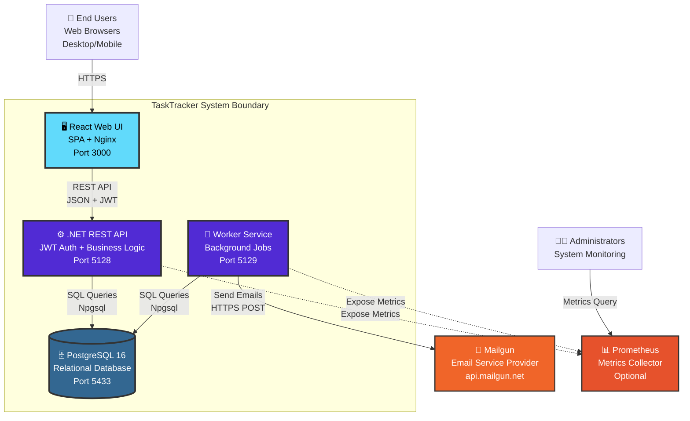

**System Responsibilities:**

- **React UI**: Renders task lists, forms, authentication screens; handles client-side validation
- **API**: Authenticates users, validates input, enforces authorization, persists data
- **Worker**: Sends scheduled email reminders, respects daily quotas, ensures idempotency
- **PostgreSQL**: Stores users, tasks, attachments, audit logs, refresh tokens
- **Mailgun**: Delivers transactional emails (reminders, notifications)

---

### Level 2: Container Diagram

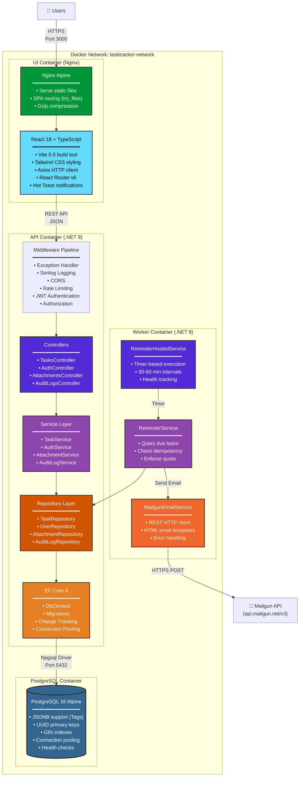

**Container Resources:**

| Container | Base Image | CPU Limit | Memory Limit | Restart Policy | Volumes |
|-----------|-----------|-----------|--------------|----------------|---------|
| UI | node:18-alpine → nginx:alpine | 0.5 core | 512 MB | unless-stopped | None (stateless) |
| API | mcr.microsoft.com/dotnet/aspnet:9.0 | 1.0 core | 1 GB | unless-stopped | api_logs |
| Worker | mcr.microsoft.com/dotnet/aspnet:9.0 | 0.5 core | 512 MB | unless-stopped | worker_logs |
| PostgreSQL | postgres:16-alpine | 1.0 core | 1 GB | unless-stopped | postgres_data |

---

### Level 3: Clean Architecture Layers

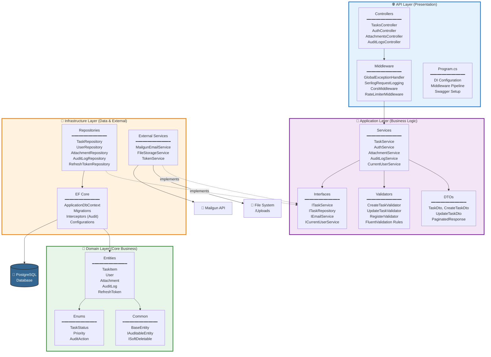

**Dependency Rules:**

```
┌─────────────────────────────────────────────────────┐
│ Dependency Direction (Inward Only)                  │
├─────────────────────────────────────────────────────┤
│ API Layer         ──►  Application Layer            │
│ Application Layer ──►  Domain Layer                 │
│ Infrastructure    ──►  Application Layer (via DI)   │
│                                                      │
│ ⛔ Domain Layer has ZERO external dependencies      │
│ ✅ Infrastructure implements Application interfaces │
└─────────────────────────────────────────────────────┘
```

---

## 🎨 UML Diagrams

### Class Diagram - Domain Model

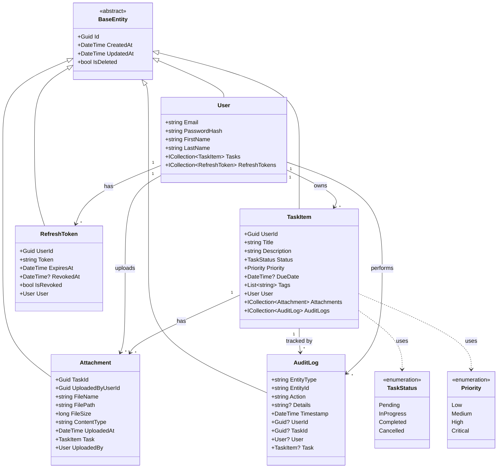

### Class Diagram - Service Layer

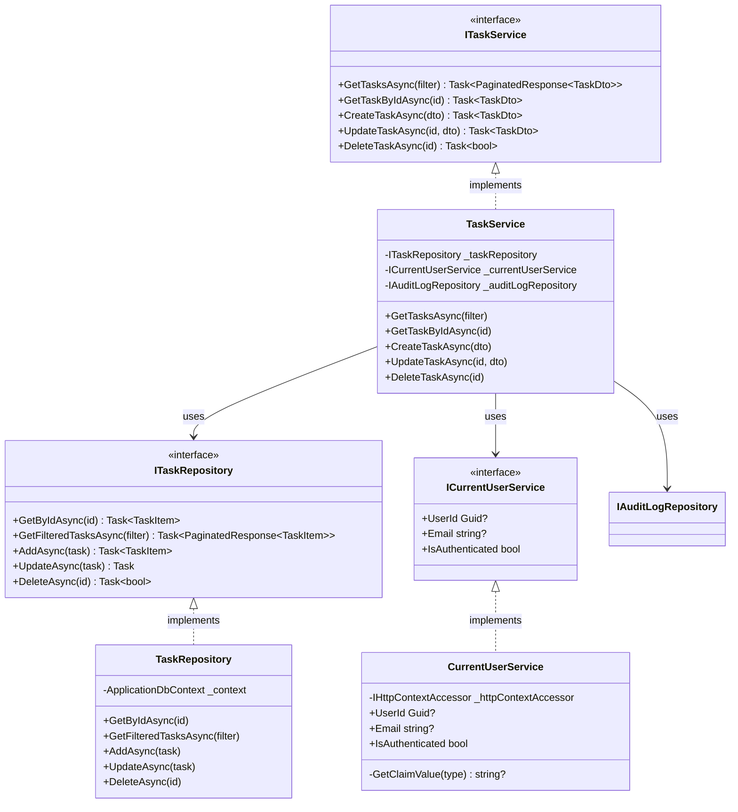

---

## 🗄️ Database Architecture

### Entity-Relationship Diagram

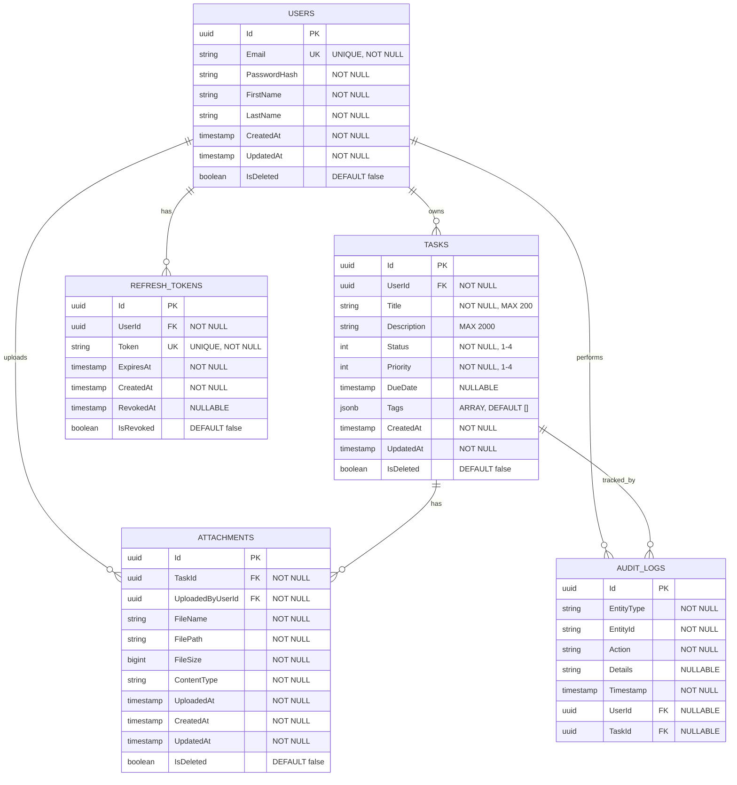

### Database Indexes

| Table | Index Name | Columns | Type | Purpose |
|-------|-----------|---------|------|---------|
| Users | IX_Users_Email | Email | BTREE | Fast email lookup for login |
| Tasks | IX_Tasks_UserId | UserId | BTREE | Filter tasks by owner |
| Tasks | IX_Tasks_Status | Status | BTREE | Filter by status |
| Tasks | IX_Tasks_DueDate | DueDate | BTREE | Find tasks due soon |
| Tasks | IX_Tasks_Tags | Tags | GIN | JSONB array search |
| Attachments | IX_Attachments_TaskId | TaskId | BTREE | Load task attachments |
| AuditLogs | IX_AuditLogs_EntityType | EntityType | BTREE | Filter logs by entity |
| AuditLogs | IX_AuditLogs_TaskId | TaskId | BTREE | Task audit history |
| RefreshTokens | IX_RefreshTokens_Token | Token | BTREE | Validate refresh tokens |
| RefreshTokens | IX_RefreshTokens_UserId | UserId | BTREE | User token management |

---

## 🔄 Sequence Diagrams

### User Authentication Flow

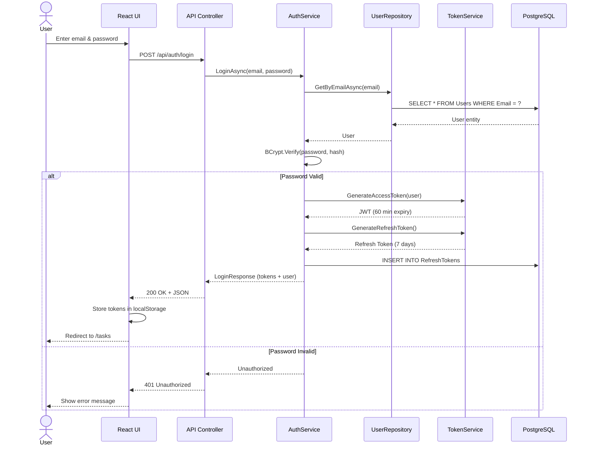

### Task Creation Flow

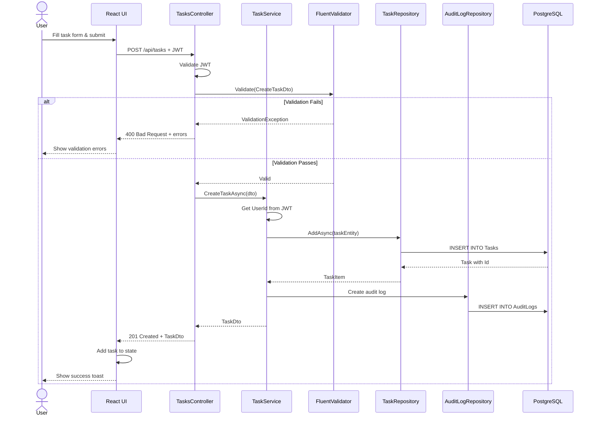

### Email Reminder Flow

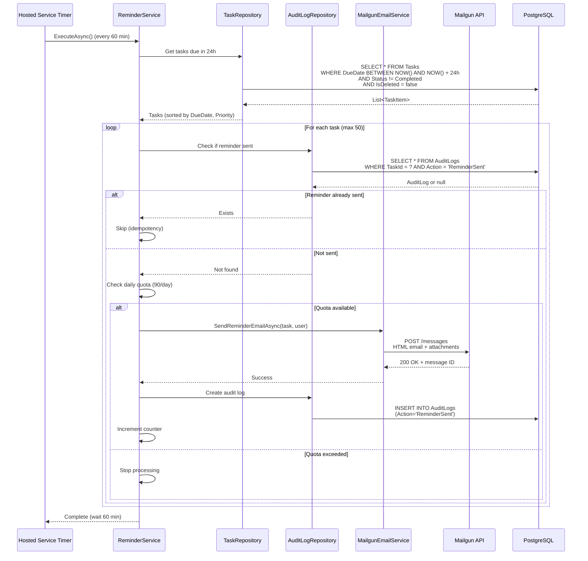

---

## 🚀 Deployment Architecture

### Docker Compose Orchestration

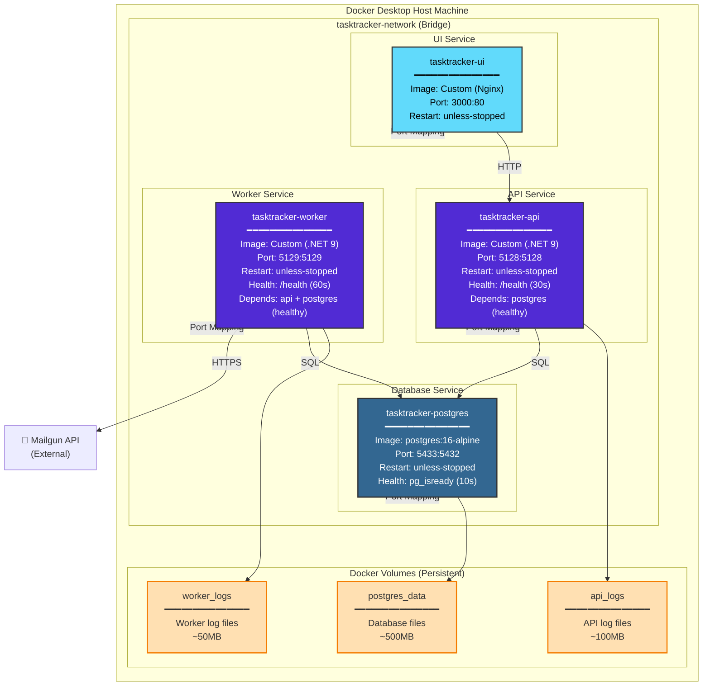

### Health Check Configuration

| Service | Endpoint | Interval | Timeout | Retries | Start Period |
|---------|----------|----------|---------|---------|--------------|
| PostgreSQL | `pg_isready` | 10s | 5s | 5 | N/A |
| API | `GET /health` | 30s | 10s | 3 | 40s |
| Worker | `GET /health` | 60s | 10s | 3 | 30s |
| UI | N/A (static) | N/A | N/A | N/A | N/A |

### Startup Sequence

```
1. PostgreSQL starts → waits for health check (pg_isready)
2. API starts → depends on PostgreSQL (healthy) → waits for own health check
3. Worker starts → depends on API + PostgreSQL (both healthy) → waits for health check
4. UI starts → depends on API (healthy) → no health check (static files)
```

### Deployment Diagram (Docker Desktop)

```
┌────────────────────────────────────────────────────────────────────┐
│                       Docker Desktop Host                          │
│                                                                    │
│  ┌──────────────────────┐     ┌──────────────────────┐           │
│  │  task-tracker-ui     │     │  task-tracker-api    │           │
│  │  ──────────────────  │     │  ──────────────────  │           │
│  │  Container           │     │  Container           │           │
│  │  ────────           │     │  ────────           │           │
│  │  • Node.js 18        │     │  • .NET 9 Runtime    │           │
│  │  • Vite Dev Server   │     │  • Kestrel HTTP      │           │
│  │  • Port: 3000        │     │  • Port: 5128        │           │
│  │  • Volume: /app      │     │  • Volume: logs/     │           │
│  └──────────────────────┘     └──────────┬───────────┘           │
│                                           │                        │
│  ┌──────────────────────┐     ┌──────────▼───────────┐           │
│  │ task-tracker-worker  │     │ tasktracker-postgres │           │
│  │ ──────────────────── │     │ ──────────────────── │           │
│  │  Container           │     │  Container           │           │
│  │  ────────           │     │  ────────           │           │
│  │  • .NET 9 Runtime    │     │  • PostgreSQL 16     │           │
│  │  • Worker Service    │     │  • Port: 5433        │           │
│  │  • Volume: logs/     │     │  • Volume: data/     │           │
│  └──────────┬───────────┘     └──────────────────────┘           │
│             │                                                     │
│             └────────────► PostgreSQL ◄────────────┘             │
│                                                                   │
│  ┌──────────────────────────────────────────────────────────────┐ │
│  │              Docker Network: tasktracker-network             │ │
│  └──────────────────────────────────────────────────────────────┘ │
│                                                                    │
│  External Volumes:                                                │
│  • postgres_data (persistent database storage)                   │
│  • api_logs (API application logs)                               │
│  • worker_logs (Worker service logs)                             │
└────────────────────────────────────────────────────────────────────┘
```

### 6. Data Flow Diagrams

#### Task Creation Flow

```
User ──► React UI ──► POST /api/tasks ──► TasksController
                                             │
                                             ▼
                                        TaskService
                                             │
                                             ▼
                                        TaskRepository
                                             │
                                             ▼
                                        EF Core DbContext
                                             │
                                             ▼
                                        PostgreSQL
                                             │
                                             ▼
                                        AuditLog Created
                                             │
                                             ▼
                                        Metrics Recorded
```

#### Email Reminder Flow

```
Worker Service (every 30-60 min)
    │
    ▼
ReminderHostedService
    │
    ▼
ReminderService.ProcessRemindersAsync()
    │
    ├──► Query Tasks (due within 24h, not completed)
    │
    ├──► Check AuditLog (idempotency - already sent?)
    │
    ├──► Check Daily Quota (90 emails/day)
    │
    ├──► Sort by DueDate, Priority
    │
    └──► For each task:
         ├──► MailgunEmailService.SendReminderEmailAsync()
         │       │
         │       ▼
         │    Mailgun API (HTTP POST)
         │
         ├──► AuditLog.Create("Reminder sent")
         │
         └──► Metrics.RecordReminderSent()
```

#### Authentication Flow

```
User Login Request
    │
    ▼
POST /api/auth/login
    │
    ▼
AuthController.Login()
    │
    ▼
AuthService.LoginAsync()
    │
    ├──► UserRepository.GetByEmailAsync()
    │
    ├──► BCrypt.Verify(password, hash)
    │
    ├──► TokenService.GenerateAccessToken() (JWT, 60 min)
    │
    ├──► TokenService.GenerateRefreshToken() (7 days)
    │
    ├──► RefreshTokenRepository.SaveAsync()
    │
    └──► Return LoginResponseDto
         {
           accessToken: "eyJ...",
           refreshToken: "...",
           user: {...}
         }
```

---

## 🔒 Security Architecture

### Authentication & Authorization Flow

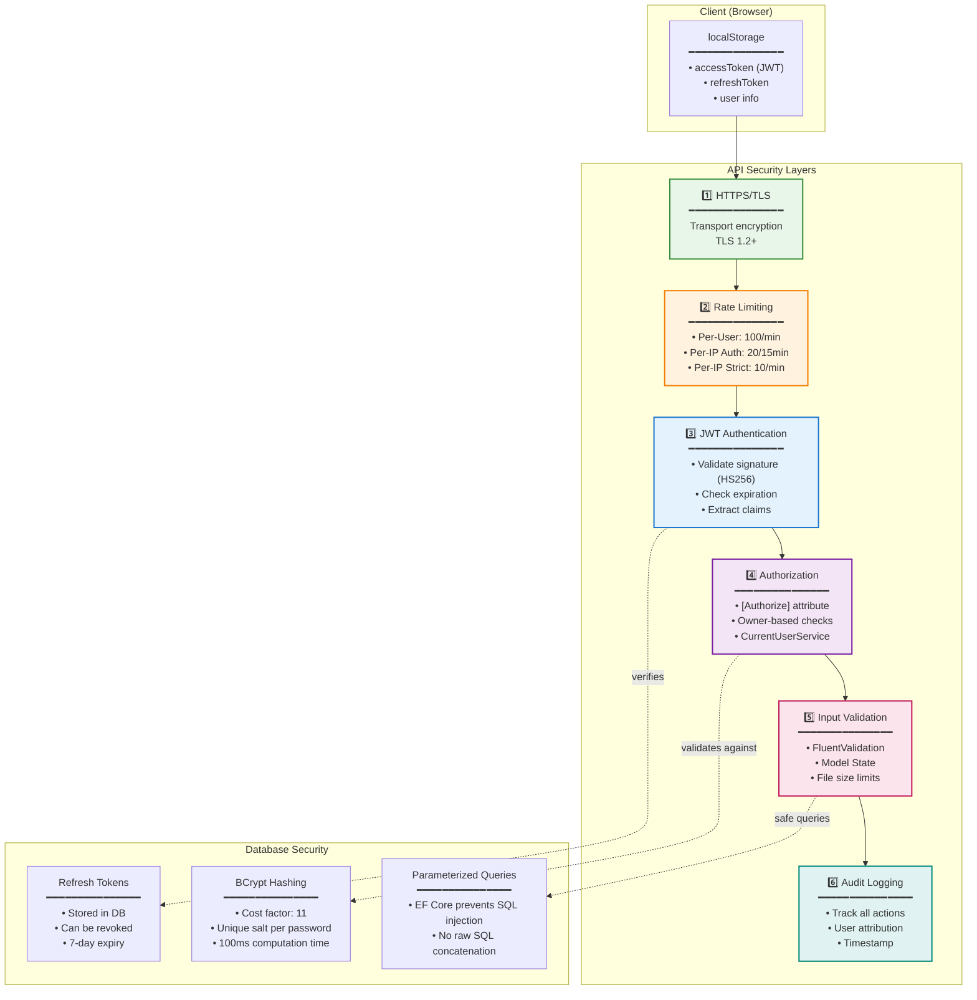

### Security Measures Summary

| Layer | Implementation | Protection Against |
|-------|---------------|-------------------|
| **Transport** | HTTPS (TLS 1.2+) | Man-in-the-middle attacks, eavesdropping |
| **Rate Limiting** | 3-tier ASP.NET Core policy | Brute force, DDoS, credential stuffing |
| **Authentication** | JWT (HS256) + BCrypt | Unauthorized access, password guessing |
| **Authorization** | [Authorize] + ownership checks | Privilege escalation, data access violations |
| **Input Validation** | FluentValidation + model state | Injection attacks, malformed data |
| **Audit Logging** | All operations logged | Forensics, compliance, accountability |
| **CORS** | Specific origin whitelist | Cross-origin attacks |
| **SQL Injection** | EF Core parameterized queries | Database manipulation |

### Data Flow Diagrams

#### Task Creation Flow

```
User ──► React UI ──► POST /api/tasks ──► TasksController
                                             │
                                             ▼
                                        TaskService
                                             │
                                             ▼
                                        TaskRepository
                                             │
                                             ▼
                                        EF Core DbContext
                                             │
                                             ▼
                                        PostgreSQL
                                             │
                                             ▼
                                        AuditLog Created
                                             │
                                             ▼
                                        Metrics Recorded
```

#### Authentication Flow

```
User Login Request
    │
    ▼
POST /api/auth/login
    │
    ▼
AuthController.Login()
    │
    ▼
AuthService.LoginAsync()
    │
    ├──► UserRepository.GetByEmailAsync()
    │
    ├──► BCrypt.Verify(password, hash)
    │
    ├──► TokenService.GenerateAccessToken() (JWT, 60 min)
    │
    ├──► TokenService.GenerateRefreshToken() (7 days)
    │
    ├──► RefreshTokenRepository.SaveAsync()
    │
    └──► Return LoginResponseDto
         {
           accessToken: "eyJ...",
           refreshToken: "...",
           user: {...}
         }
```

---

## 📈 Monitoring & Observability

### Metrics Architecture

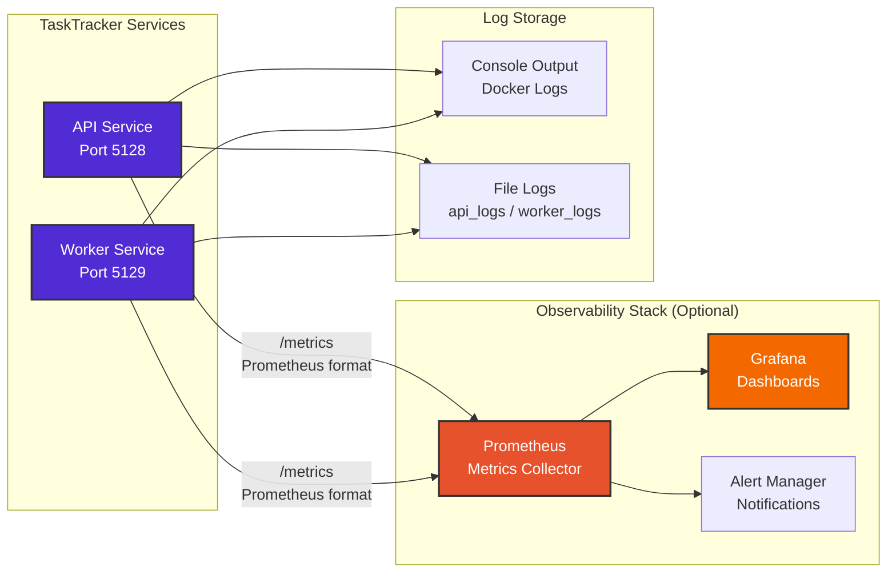

### Key Metrics Exposed

| Metric Type | Metric Name | Description |
|-------------|------------|-------------|
| **HTTP** | `http_requests_received_total` | Total HTTP requests by method, endpoint, status |
| **HTTP** | `http_request_duration_seconds` | Request duration histogram |
| **Tasks** | `tasks_created_total` | Counter of tasks created |
| **Tasks** | `tasks_updated_total` | Counter of tasks updated |
| **Tasks** | `tasks_deleted_total` | Counter of tasks deleted |
| **Auth** | `auth_login_attempts_total` | Login attempts (success/failure) |
| **Email** | `worker_reminders_sent_total` | Email reminders sent |
| **Email** | `worker_email_quota_remaining` | Daily email quota remaining |
| **Health** | `worker_last_run_timestamp` | Last successful worker execution |

### Logging Configuration

```json
{
  "Serilog": {
    "MinimumLevel": {
      "Default": "Information",
      "Override": {
        "Microsoft": "Warning",
        "System": "Warning"
      }
    },
    "WriteTo": [
      {
        "Name": "Console",
        "Args": {
          "outputTemplate": "[{Timestamp:yyyy-MM-DD HH:mm:ss} {Level:u3}] {Message:lj} {Properties:j}{NewLine}{Exception}"
        }
      },
      {
        "Name": "File",
        "Args": {
          "path": "logs/api-.log",
          "rollingInterval": "Day",
          "retainedFileCountLimit": 30
        }
      }
    ],
    "Enrich": ["FromLogContext", "WithMachineName", "WithThreadId"]
  }
}
```

### Health Checks

**API Health Endpoints:**
- `GET /health` - Overall status with JSON details (database connectivity, memory usage, response time)
- `GET /health/db` - Database connectivity only

**Worker Health Service:**
- Last successful run timestamp
- Failed jobs count
- Total jobs run
- Health status (healthy if run within 2 hours)

### Observability Stack Details

```
┌─────────────────────────────────────────────────────────────────┐
│                   Observability Stack                            │
│                                                                  │
│  ┌──────────────────────────────────────────────────────────┐  │
│  │                      Metrics                              │  │
│  │  ┌────────────────────────────────────────────────────┐  │  │
│  │  │ Prometheus Metrics                                  │  │  │
│  │  │ ──────────────────                                 │  │  │
│  │  │ • HTTP request count, duration, errors             │  │  │
│  │  │ • Task operations (created, updated, deleted)      │  │  │
│  │  │ • Authentication success/failure                    │  │  │
│  │  │ • Worker reminders (sent, failed, skipped)         │  │  │
│  │  │ • Email quota remaining                             │  │  │
│  │  │                                                     │  │  │
│  │  │ Endpoints:                                          │  │  │
│  │  │ • GET /metrics (API)                                │  │  │
│  │  └────────────────────────────────────────────────────┘  │  │
│  └──────────────────────────────────────────────────────────┘  │
│                                                                  │
│  ┌──────────────────────────────────────────────────────────┐  │
│  │                      Logging                              │  │
│  │  ┌────────────────────────────────────────────────────┐  │  │
│  │  │ Serilog (Structured Logging)                        │  │  │
│  │  │ ────────────────────────────                       │  │  │
│  │  │ Sinks:                                              │  │  │
│  │  │ • Console (stdout)                                  │  │  │
│  │  │ • File (rolling daily)                              │  │  │
│  │  │   - logs/api-YYYYMMDD.log                          │  │  │
│  │  │   - logs/worker-YYYYMMDD.log                       │  │  │
│  │  │                                                     │  │  │
│  │  │ Log Levels:                                         │  │  │
│  │  │ • Production: Information, Warning, Error           │  │  │
│  │  │ • Development: Debug, Information                   │  │  │
│  │  │                                                     │  │  │
│  │  │ Enrichers:                                          │  │  │
│  │  │ • Correlation ID (request tracking)                 │  │  │
│  │  │ • Timestamp, Level, Message, Exception              │  │  │
│  │  └────────────────────────────────────────────────────┘  │  │
│  └──────────────────────────────────────────────────────────┘  │
│                                                                  │
│  ┌──────────────────────────────────────────────────────────┐  │
│  │                   Health Checks                           │  │
│  │  ┌────────────────────────────────────────────────────┐  │  │
│  │  │ API Health Endpoints                                │  │  │
│  │  │ ────────────────────                               │  │  │
│  │  │ • GET /health (overall status with JSON details)   │  │  │
│  │  │   - Database connectivity                           │  │  │
│  │  │   - Memory usage                                    │  │  │
│  │  │   - Response time                                   │  │  │
│  │  │                                                     │  │  │
│  │  │ • GET /health/db (database only)                    │  │  │
│  │  └────────────────────────────────────────────────────┘  │  │
│  │                                                            │  │
│  │  ┌────────────────────────────────────────────────────┐  │  │
│  │  │ Worker Health Service                               │  │  │
│  │  │ ─────────────────────                              │  │  │
│  │  │ • Last successful run timestamp                     │  │  │
│  │  │ • Failed jobs count                                 │  │  │
│  │  │ • Total jobs run                                    │  │  │
│  │  │ • Health status (healthy if run within 2 hours)    │  │  │
│  │  └────────────────────────────────────────────────────┘  │  │
│  └──────────────────────────────────────────────────────────┘  │
└─────────────────────────────────────────────────────────────────┘
```

---

## 📊 Technology Stack

### Backend Technologies

| Category | Technology | Version | Purpose |
|----------|-----------|---------|---------|
| **Framework** | .NET | 9.0 | Web API + Worker Service |
| **Web Framework** | ASP.NET Core | 9.0 | REST API, Middleware, DI |
| **ORM** | Entity Framework Core | 9.0 | Database access, migrations |
| **Database Driver** | Npgsql | 9.0 | PostgreSQL connectivity |
| **Authentication** | Microsoft.AspNetCore.Authentication.JwtBearer | 9.0 | JWT validation |
| **Password Hashing** | BCrypt.Net-Next | 4.0 | Secure password storage |
| **Validation** | FluentValidation.AspNetCore | 12.0 | Input validation |
| **Logging** | Serilog.AspNetCore | 9.0 | Structured logging |
| **Metrics** | prometheus-net.AspNetCore | 8.2 | Prometheus metrics |
| **API Documentation** | Swashbuckle.AspNetCore | 6.8 | Swagger/OpenAPI |
| **HTTP Client** | RestSharp | 112.0 | Mailgun API calls |
| **Testing** | xUnit + Moq + FluentAssertions | Latest | Unit & integration tests |

### Frontend Technologies

| Category | Technology | Version | Purpose |
|----------|-----------|---------|---------|
| **Framework** | React | 18.2 | UI library |
| **Language** | TypeScript | 5.2 | Type safety |
| **Build Tool** | Vite | 5.0 | Dev server + bundler |
| **Routing** | React Router | 6.20 | Client-side routing |
| **HTTP Client** | Axios | 1.6 | API requests |
| **Styling** | Tailwind CSS | 3.3 | Utility-first CSS |
| **Notifications** | React Hot Toast | 2.4 | Toast messages |
| **Date Utils** | date-fns | 3.0 | Date manipulation |
| **Icons** | Lucide React | 0.294 | Icon library |

### Infrastructure

| Category | Technology | Version | Purpose |
|----------|-----------|---------|---------|
| **Database** | PostgreSQL | 16-alpine | Relational database |
| **Web Server** | Nginx | Alpine | Static file serving |
| **Containerization** | Docker | Latest | Container runtime |
| **Orchestration** | Docker Compose | 3.8 | Multi-container apps |
| **Email Service** | Mailgun | API v3 | Transactional emails |

---

## 📚 Additional Resources

- **[Architecture Rationale](./ARCHITECTURE_RATIONALE.md)** - Detailed design decisions and trade-offs
- **[Database Scripts](../DATABASE_SCRIPTS.md)** - SQL utilities for database management
- **[Docker Deployment Guide](../DOCKER_DEPLOYMENT.md)** - Complete Docker setup instructions
- **[Phase Documentation](../Phases/)** - Implementation phases (1-5)
- **[API Documentation](http://localhost:5128/swagger)** - Interactive OpenAPI docs (when running)

---

**Document Version:** 2.0  
**Status:** Production Ready ✅  
**Last Updated:** November 28, 2025  
**Total Tests:** 113 (passing)  
**Docker Services:** 4 (UI, API, Worker, PostgreSQL)
